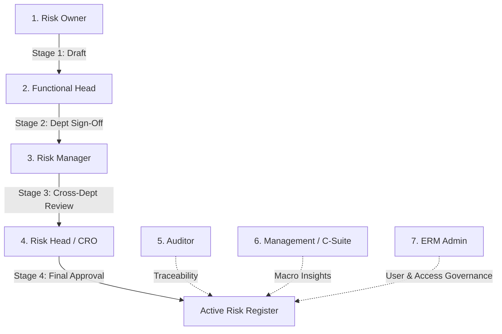

# 🛡️ ERM Copilot – Enterprise AI Risk Management Intelligence Engine

**ERM Copilot** is a high-performance, decoupled Artificial Intelligence engine built for mission-critical **Enterprise Risk Management (ERM)** across industrial refineries, gas processing plants, petrochemical units, and corporate governance.

---

## 📚 Complete Documentation Index

All architectural specifications, database models, and workflow guides are documented in the [`docs/`](./docs/) directory:

| Guide | Description |
| :--- | :--- |
| 🏛️ **[01. System Architecture](./docs/01_ARCHITECTURE_OVERVIEW.md)** | Decoupled architecture, 7 RBAC roles, component diagram, and data flow. |
| 🗄️ **[02. Database & Schema](./docs/02_DATABASE_AND_SCHEMA.md)** | PostgreSQL `ers` schema, ER diagram, foreign keys, 5×5 matrix, and status codes. |
| 🌐 **[03. LLM Gateway & Routing](./docs/03_LLM_GATEWAY_ROUTING.md)** | Multi-provider fallback across Portkey, Groq LLaMA 3.3, Gemini 2.5 Flash, and Mesh API. |
| 🧙‍♂️ **[04. Conversational Wizard Guide](./docs/04_CONVERSATIONAL_WIZARD_GUIDE.md)** | 5-step state machine for natural language risk drafting and automated mitigation matrix. |
| 🛡️ **[05. Governance & Approvals](./docs/05_GOVERNANCE_AND_APPROVAL_WORKFLOW.md)** | 4-stage governance approval lifecycle, 1-click approvals, and audit trail reconstruction. |
| 🔌 **[06. API & Integration Endpoints](./docs/06_API_INTEGRATION_AND_ENDPOINTS.md)** | Web Portal integration (`/api/erm/chat`), contracts, and interactive button tokens. |
| 🚀 **[07. Dev & Deployment Guide](./docs/07_DEVELOPMENT_AND_DEPLOYMENT_GUIDE.md)** | Prerequisites, environment configurations, troubleshooting FAQ, and standalone testing. |

---

## 🏗️ Directory & Module Layout

```
d:\Chatboat\ERM\ERM_Copilot\
├── agents\
│   ├── base.py                   # BaseAgent abstract interface
│   └── agent.py                  # ERMCopilotAgent with State Machine & Intent Handling
├── config\
│   └── settings.py               # Prioritized environment configurations (MassERS DB, LLMs)
├── docs\                         # Dedicated documentation suite
│   ├── 01_ARCHITECTURE_OVERVIEW.md
│   ├── 02_DATABASE_AND_SCHEMA.md
│   ├── 03_LLM_GATEWAY_ROUTING.md
│   ├── 04_CONVERSATIONAL_WIZARD_GUIDE.md
│   ├── 05_GOVERNANCE_AND_APPROVAL_WORKFLOW.md
│   ├── 06_API_INTEGRATION_AND_ENDPOINTS.md
│   └── 07_DEVELOPMENT_AND_DEPLOYMENT_GUIDE.md
├── gateway\
│   └── client.py                 # Multi-Provider resilient LLM Gateway
├── models\
│   ├── contracts.py              # AgentRequest, AgentResponse, RequestContext
│   └── schemas.py                # Pydantic schemas (RiskItem, RiskTreatmentPlan)
├── services\
│   ├── api_client.py             # REST integration with ESM Core API (port 8001)
│   └── db_service.py             # High-performance direct PostgreSQL service
├── __init__.py                   # Package exports
└── README.md                     # Master documentation & Quickstart
```

---

## 👥 7 ERM Stakeholder Roles Supported



---

## ⚡ Quick Start Example

```python
from ERM_Copilot import erm_copilot_agent, AgentRequest

# 1. Prepare Request
request = AgentRequest(
    message="Give department-wise risk profile summary",
    user_role="Risk Head",
    user_id="2",
    parameters={"role": "Risk Head", "dept_name": "All", "user_id": 2}
)

# 2. Process through Copilot Agent
response = erm_copilot_agent.process(request)

# 3. Print Rich Formatted Markdown Output
print(response.response)
```

---

## 🔒 Security & Data Integrity

- **Parameterized SQL:** All queries in `ERMDatabaseService` use strict parameterized queries, preventing SQL injection.
- **RBAC Strict Scoping:** Department-level users only receive filtered data from their assigned unit, while enterprise roles (Risk Head, Risk Manager, Admin) access enterprise-wide summaries.
- **Atomic State Transitions:** Multi-stage sign-offs update timestamps and approver user IDs atomically in PostgreSQL (`MassERS`).
