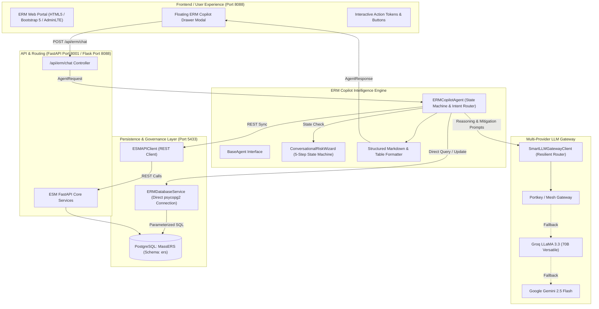

# 🏛️ ERM Copilot – Architecture Overview

## 1. Executive Summary

**ERM Copilot** is a high-performance, decoupled Artificial Intelligence agent designed specifically for Enterprise Risk Management (ERM). Operating within mission-critical industrial environments (refineries, petrochemicals, gas processing, and corporate operations), the Copilot provides interactive risk assessment, conversational risk creation, approval automation, audit trail reconstruction, and real-time risk heatmaps.

---

## 2. High-Level System Architecture



---

## 3. Core Principles & Design Tenets

1. **Decoupled Architecture:** `ERM_Copilot` is packaged as an independent module with zero hard circular dependencies on the web framework.
2. **Role-Based Access Control (RBAC):** Tailors queries, approvals, and data visibility across all **7 ERM Stakeholder Roles**.
3. **Deterministic Persistence:** Critical governance actions (risk creation, multi-stage approvals, rejections) execute parameterized SQL updates directly into PostgreSQL with atomic commits, ensuring zero hallucinated transactions.
4. **Resilient Multi-Provider LLM Gateway:** Guarantees 99.99% reasoning uptime through intelligent failover from Portkey to Groq to Gemini.
5. **Interactive Action Tokens:** Outputs rich Markdown tables accompanied by click-to-execute tokens `[btn:Label|Command]` and `[btn-confirm:Label|Command]` enabling instant one-click approvals in the UI.

---

## 4. Role-Based Access Control (RBAC) Architecture

| Role ID | ERM Role Name | Scope | Key Copilot Capabilities |
| :---: | :--- | :--- | :--- |
| **1** | **Risk Owner (RO)** | Department-Specific | Drafts new risks via 5-step wizard, calculates 5×5 Likelihood × Impact scores, selects Action Owners. |
| **2** | **Functional Head (FH)** | Department-Specific | Reviews Stage 2 submitted risks, performs 1-click technical sign-offs or returns with revision notes. |
| **3** | **Risk Manager (RM)** | Cross-Department | Audits risk mitigations, validates 4-tier treatments, executes Stage 3 managerial sign-offs. |
| **4** | **Risk Head / CRO (RH)** | Enterprise-Wide | Conducts Stage 4 final executive approvals, monitors plant-wide 5×5 heatmaps, reviews escalations. |
| **5** | **Auditor** | Enterprise-Wide | Inspects immutable audit trails, verifies approval timestamps, reviews change histories. |
| **6** | **Management / C-Suite** | Enterprise-Wide | Analyzes macro risk profiles, monitors departmental risk summaries and critical plant hazards. |
| **7** | **ERM Admin / Super Admin** | Enterprise-Wide | Manages user-department mappings, oversees system health, monitors operational queues. |

---

## 5. Directory Structure & Key Modules

```
d:\Chatboat\ERM\ERM_Copilot\
├── agents\
│   ├── base.py                   # BaseAgent abstract contract
│   └── agent.py                  # ERMCopilotAgent with State Machine & Intent Handling
├── config\
│   └── settings.py               # Prioritized environment configurations & credentials
├── docs\                         # Comprehensive system documentation
│   ├── 01_ARCHITECTURE_OVERVIEW.md
│   ├── 02_DATABASE_AND_SCHEMA.md
│   ├── 03_LLM_GATEWAY_ROUTING.md
│   ├── 04_CONVERSATIONAL_WIZARD_GUIDE.md
│   ├── 05_GOVERNANCE_AND_APPROVAL_WORKFLOW.md
│   ├── 06_API_INTEGRATION_AND_ENDPOINTS.md
│   └── 07_DEVELOPMENT_AND_DEPLOYMENT_GUIDE.md
├── gateway\
│   └── client.py                 # Multi-Provider resilient LLM Gateway
├── models\
│   ├── contracts.py              # AgentRequest, AgentResponse, RequestContext
│   └── schemas.py                # Pydantic schemas (RiskItem, RiskTreatmentPlan)
├── services\
│   ├── api_client.py             # REST integration with ESM Core API (port 8001)
│   └── db_service.py             # High-performance direct PostgreSQL service
├── __init__.py                   # Package exports
└── README.md                     # Master documentation & Quickstart
```
