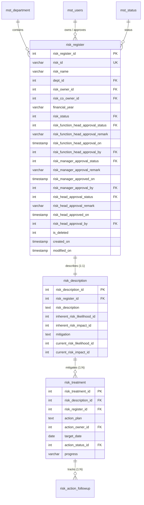

# 🗄️ Database & Schema Specifications

## 1. Database Connection & Environment Parameters

The ERM Copilot directly connects to the **MassERS** PostgreSQL database to guarantee sub-millisecond query response times and atomic write operations for critical approvals.

| Parameter | Environment Variable | Default Value | Notes |
| :--- | :--- | :--- | :--- |
| **Host** | `POSTGRES_HOST` | `localhost` | Database host server |
| **Port** | `POSTGRES_PORT` | `5433` | Dedicated PostgreSQL port for ERM |
| **Database** | `POSTGRES_DB_ERM` / `POSTGRES_DB` | `MassERS` | **Critical:** Must target `MassERS` (Schema: `ers`) |
| **User** | `POSTGRES_USER` | `postgres` | Database superuser/service account |
| **Password** | `POSTGRES_PASSWORD` | `Alethe@123` | Authentication secret |
| **Schema** | `DB_SCHEMA` | `ers` | All risk tables reside under `ers` schema |

---

## 2. Entity-Relationship Model (Schema: `ers`)

---

## 3. Key Table Definitions

### 3.1. `ers.risk_register`
Stores top-level risk header information and the full multi-tier governance approval lifecycle state:
- `risk_status`: Current lifecycle stage:
  - `1`: **Draft** (Created by Risk Owner)
  - `2`: **Submitted to Function Head** (Stage 2 Review)
  - `3`: **Function Head Approved** (Stage 3 Review - Risk Manager Queue)
  - `4`: **Risk Manager Approved** (Stage 4 Review - Risk Head / CRO Queue)
  - `5`: **Risk Head Approved (Final Sign-Off)**
- `risk_function_head_approval_*`: Approval status (`1`=Approved, `2`=Rejected), timestamp, approver user ID, and remarks.
- `risk_manager_approval_*`: Approval status, timestamp, approver user ID, and remarks.
- `risk_head_approval_*`: Final approval status, timestamp, approver user ID, and remarks.

### 3.2. `ers.risk_description`
Captures inherent and residual risk scores and baseline engineering mitigations:
- `inherent_risk_likelihood_id` (1–5) × `inherent_risk_impact_id` (1–5)
- `current_risk_likelihood_id` (1–5) × `current_risk_impact_id` (1–5)
- `mitigation`: Textual description of primary process/safety controls.

### 3.3. `ers.risk_treatment`
Captures specific action plans, milestones, and designated Action Owners:
- `action_plan`: Specific tactical maintenance/inspection action.
- `action_owner_id`: Foreign key referencing `ers.mst_users.id`.
- `target_date`: Milestone target completion date.
- `progress`: Percentage completion string (e.g. `45%`, `100%`).

---

## 4. 5×5 Risk Scoring & Color Coding Matrix

$$ \text{Risk Score} = \text{Likelihood (1–5)} \times \text{Impact (1–5)} $$

| Score Range | Severity Tier | Color Code | Badge Representation | Required Governance Action |
| :---: | :---: | :---: | :---: | :--- |
| **15 – 25** | **Critical / Extreme** | `#FF0000` | `🔴 CRITICAL` | Immediate Executive Escalation & Emergency Mitigation |
| **10 – 14** | **High Risk** | `#FFA500` | `🟠 HIGH` | Priority Department Review & Mandatory Engineering Action |
| **5 – 9** | **Medium Risk** | `#FFFF00` | `🟡 MEDIUM` | Routine Maintenance Scheduling & Periodic Monitoring |
| **1 – 4** | **Low Risk** | `#008000` | `🟢 LOW` | Standard Operating Procedure (SOP) Adherence |
