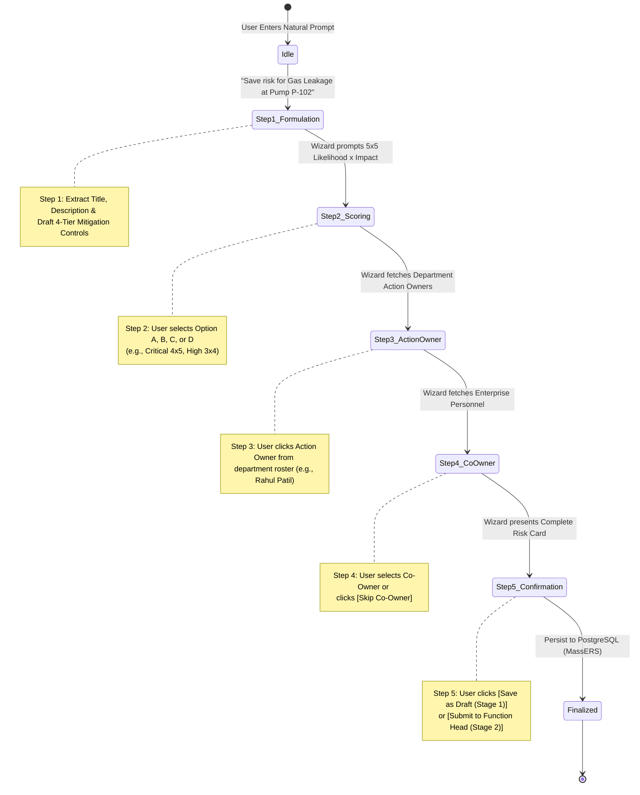

# 🧙‍♂️ Conversational Risk Creation Wizard Guide

## 1. Overview

The **`ConversationalRiskWizard`** provides a 5-step, conversational state machine that guides users through creating ISO-31000 compliant risk entries directly from natural language.

---

## 2. 5-Step State Machine Workflow

---

## 3. Detailed Step-by-Step Breakdown

### Step 1: Hazard Formulation & Mitigation Generation
- **Trigger:** User sends messages like:
  - *"Save a new risk for crude distillation overhead corrosion"*
  - *"Create hazard entry for boiler feed pump high temperature"*
- **Agent Action:** 
  1. Extracts a clean risk title and technical description.
  2. Generates an industrial **4-Tier Mitigation Strategy** (Assessment, Engineering Controls, Condition Monitoring, Operational PM).
  3. Transitions session to `AWAITING_SCORING`.

### Step 2: 5×5 Risk Matrix Scoring
- **Options Provided:**
  - **Option A (Critical / Extreme - 4×5 = 20):** Likely probability, catastrophic safety/financial consequence.
  - **Option B (High Risk - 3×4 = 12):** Possible occurrence, major operational disturbance.
  - **Option C (Medium Risk - 3×3 = 9):** Moderate operational deviation, contained locally.
  - **Option D (Low Risk - 2×2 = 4):** Minor localized deviation.
- **Agent Action:** Calculates severity score and transitions session to `AWAITING_ACTION_OWNER`.

### Step 3: Department Action Owner Assignment
- **Agent Action:** Queries `ers.mst_users` filtered by the user's active department.
- **UI Presentation:** Displays an interactive roster of eligible department engineers with 1-click action buttons `[btn:👤 Name|Assign Action Owner Name]`.

### Step 4: Enterprise Co-Owner Assignment (Optional)
- **Agent Action:** Fetches cross-department personnel roster allowing inter-department risk sharing or provides a `[btn:⏩ None (Skip Co-Owner)|Skip Co-Owner]` button.

### Step 5: Mode of Submission & Database Persistence
- **Final Risk Card Review:** Summarizes all properties (Risk Title, Inherent Score, 4-Tier Mitigation, Action Owner, Co-Owner).
- **Execution Actions:**
  - `[btn-confirm:💾 Save as Draft (Stage 1)|Save as Draft]` -> Persists with `risk_status = 1`.
  - `[btn-confirm:🚀 Submit to Function Head (Stage 2)|Submit to Function Head]` -> Persists with `risk_status = 2` and assigns it to the department Functional Head's approval queue.
