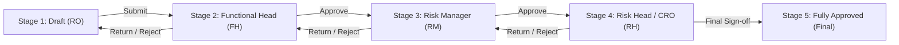

# 🛡️ Governance & Approval Workflow

## 1. Governance Approval Lifecycle

MassERS enforces a multi-tier governance model designed to comply with corporate risk governance standards and industrial safety regulations.



---

## 2. Governance Stages & State Transitions

| Stage ID | Status Name | Responsible Role | Status DB Code | Next Stage / Action |
| :---: | :--- | :--- | :---: | :--- |
| **Stage 1** | **Draft** | Risk Owner | `1` | Submits to Functional Head |
| **Stage 2** | **Submitted to FH** | Functional Head | `2` | FH technical review & sign-off |
| **Stage 3** | **Function Head Approved** | Risk Manager | `3` | RM cross-dept mitigation validation |
| **Stage 4** | **Risk Manager Approved** | Risk Head (CRO) | `4` | CRO executive sign-off |
| **Stage 5** | **Risk Head Approved (Final)** | CRO / Super Admin | `5` | Live active monitored risk |

---

## 3. 1-Click Approval Execution (`process_direct_approval`)

Users can approve or reject risks directly in conversational chat or by clicking interactive buttons:

```
[btn-confirm:✅ Approve RSK-REF-012|Approve RSK-REF-012]
[btn-cancel:❌ Return RSK-REF-012|Reject RSK-REF-012 with remark Revision Required]
```

### Direct Database Execution
When an approval command is received, `ERMDatabaseService.process_direct_approval` performs:
1. Role-specific stage validation (checks whether the user's role has authority for the risk's current stage).
2. Updates `ers.risk_register`:
   - Sets `risk_function_head_approval_status = 1`, `risk_function_head_approval_on = NOW()`, `risk_function_head_approval_by = user_id`, `risk_status = 3` (for FH).
   - Sets `risk_manager_approval_status = 1`, `risk_manager_approved_on = NOW()`, `risk_manager_approval_by = user_id`, `risk_status = 4` (for RM).
   - Sets `risk_head_approval_status = 1`, `risk_head_approved_on = NOW()`, `risk_head_approval_by = user_id`, `risk_status = 5` (for CRO).
3. Returns confirmation with timestamp, approver details, and updated lifecycle status.

---

## 4. Immutable Audit Trail Reconstruction

For auditors, regulators, and management, the Copilot reconstructs the complete audit trail by inspecting:
- Creation timestamp and Creator name.
- Modification timestamp and Modifier name.
- Functional Head approval timestamp, approver identity, and approval remark.
- Risk Manager approval timestamp, approver identity, and approval remark.
- Risk Head approval timestamp, approver identity, and approval remark.
- Associated treatment plans, target dates, and completion status.
