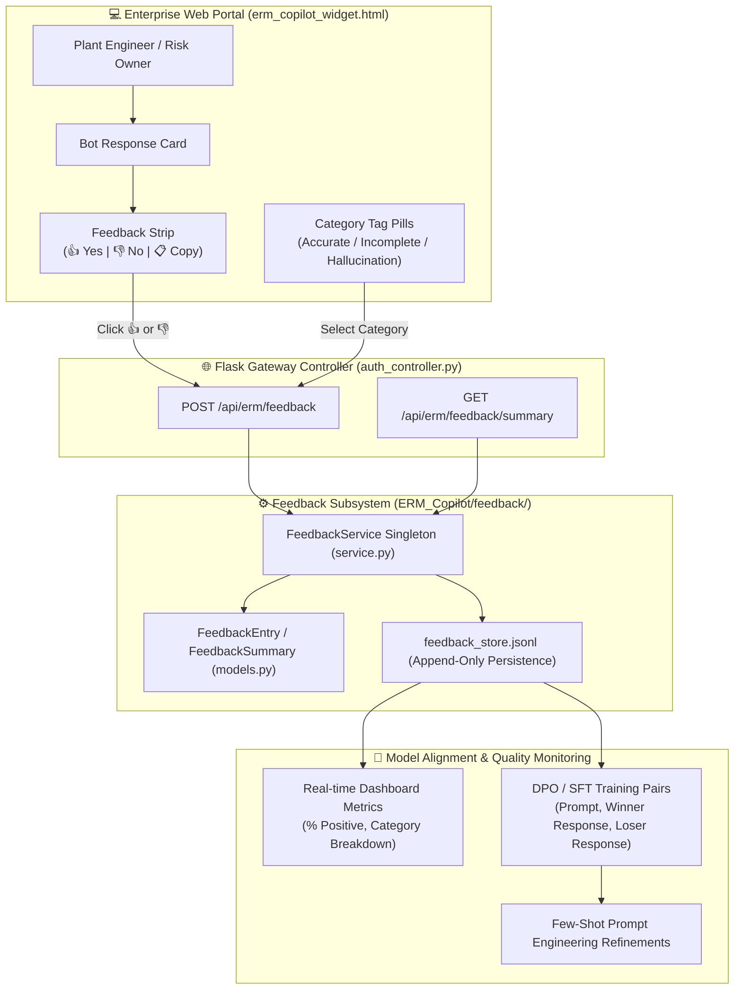
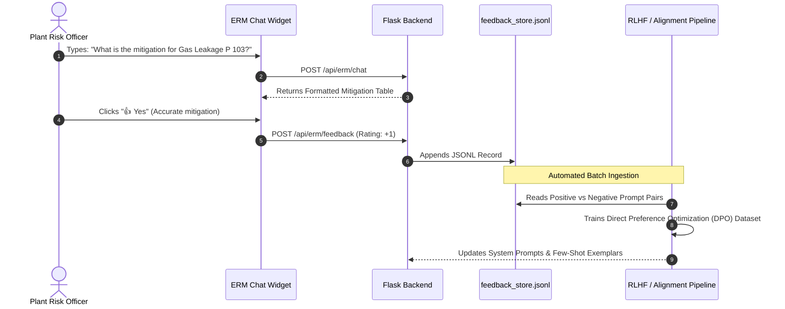

# 🌟 User Feedback & Continuous RLHF Quality Loop

<div align="center">


<p align="center">
  <b>Comprehensive technical documentation on the In-App Feedback Mechanism, User Satisfaction Telemetry, and Reinforcement Learning from Human Feedback (RLHF) Loop in ERM Copilot.</b>
</p>

</div>

---

## 1. 📌 Executive Summary

Enterprise Risk Management (ERM) decisions require continuous validation against field operator experience, plant engineer standards, and executive risk guidelines. 

The **ERM Copilot User Feedback Loop** provides a frictionless, non-intrusive feedback interface directly inside the Web Portal chat UI, capturing:
1. **Binary Ratings (👍 / 👎):** Real-time sentiment and helpfulness tracking on every AI response.
2. **Qualitative Categories:** Categorized user feedback (e.g., `accurate_risk_data`, `hallucination_detected`, `format_error`, `mitigation_effective`).
3. **One-Click Response Copy:** Instant Markdown copying for team reports and mitigation review meetings.
4. **Role & Departmental Context:** Feedback is bound to user roles (Admin, Risk Owner, Functional Head) and departments (Refining, HSE, Pipeline) to spot domain-specific quality drifts.
5. **Persistent RLHF Dataset Export:** Feedback is written to disk in standard `.jsonl` formats ready for direct ingestion into Direct Preference Optimization (DPO) and Supervised Fine-Tuning (SFT) training pipelines.

---

## 2. 🏛️ Architecture & End-to-End Execution Flow



---

## 3. 📐 Feedback Data Model & Schema

All feedback entries conform to the strongly-typed `FeedbackEntry` model in [`ERM_Copilot/feedback/models.py`](file:///d:/ERM/ERM_Copilot/feedback/models.py):

```python
class FeedbackEntry(BaseModel):
    feedback_id: str = Field(default_factory=lambda: f"FB-{uuid.uuid4().hex[:8].upper()}")
    timestamp: str = Field(default_factory=lambda: datetime.now(timezone.utc).isoformat())
    request_id: Optional[str] = None
    rating: int = Field(..., description="+1 for positive (thumbs up), -1 for negative (thumbs down)")
    category: Optional[str] = Field(None, description="E.g., accurate_risk_data, hallucination, wrong_math")
    comment: Optional[str] = None
    user_id: Optional[str] = None
    user_role: Optional[str] = None
    department: Optional[str] = None
    prompt: Optional[str] = None
    response_snippet: Optional[str] = None
    metadata: Dict[str, Any] = Field(default_factory=dict)
```

### Feedback Summary Aggregate Schema
```python
class FeedbackSummary(BaseModel):
    total_feedback: int = 0
    positive_count: int = 0
    negative_count: int = 0
    satisfaction_rate_pct: float = 100.0
    category_distribution: Dict[str, int] = Field(default_factory=dict)
```

---

## 4. 🔌 API Contracts

### 4.1 Submit User Feedback
- **Route:** `POST /api/erm/feedback`
- **Content-Type:** `application/json`

#### Request Payload:
```json
{
  "rating": 1,
  "category": "accurate_risk_data",
  "comment": "Mitigation Plan 53B dual seal was highly accurate.",
  "user_id": "5",
  "role": "Risk Owner",
  "department": "Refining Operations",
  "prompt": "What are active risks in refining?",
  "response": "Risk RSK-REF-014: Pipeline Burst at Plant 123..."
}
```

#### Response Payload (200 OK):
```json
{
  "status": "success",
  "feedback_id": "FB-0503E6D2",
  "message": "Thank you! Your feedback helps continuously improve ERM AI quality."
}
```

---

### 4.2 Query Aggregate Satisfaction Metrics
- **Route:** `GET /api/erm/feedback/summary`

#### Response Payload (200 OK):
```json
{
  "status": "success",
  "data": {
    "total_feedback": 42,
    "positive_count": 39,
    "negative_count": 3,
    "satisfaction_rate_pct": 92.86,
    "category_distribution": {
      "accurate_risk_data": 32,
      "helpful_mitigation": 7,
      "format_error": 2,
      "missing_details": 1
    }
  }
}
```

---

## 5. 🖥️ Web Portal Widget UI Integration

The feedback strip is embedded below every assistant message in [`ERM_WEB_APP/app/templates/partials/erm_copilot_widget.html`](file:///d:/ERM/ERM_WEB_APP/app/templates/partials/erm_copilot_widget.html).

### Visual UI States:
1. **Default State:**
   - `👍 Yes` (Subtle grey border, hover green glow)
   - `👎 No` (Subtle grey border, hover red glow)
   - `📋 Copy` (Instant clipboard action with feedback tooltip)
2. **Selected Positive State:**
   - Active green badge: `👍 Helpful` with pulsating border.
3. **Selected Negative State:**
   - Active red badge: `👎 Needs Improvement` with category selection pills.

---

## 6. 🔄 RLHF Continuous Improvement Workflow



### Curation Pipeline for DPO:
1. **Preference Pairs:** Queries that receive both a negative rating (e.g., initial ambiguous response) and a subsequent positive rating (after clarification) are paired as $(y_w, y_l)$.
2. **Guardrail Calibration:** Queries flagged with negative tags are fed to the [AI Evaluation Harness (`dataset.py`)](file:///d:/ERM/ERM_Copilot/harness/dataset.py) as new regression test cases.
3. **Departmental Drift Analysis:** Satisfaction rates broken down by department allow targeting engineering prompts for specific plant operational units.

---

## 7. 🧪 Verification & Testing

Run the automated feedback test script:
```bash
.\myenv\Scripts\python.exe -c "from ERM_Copilot.feedback.service import erm_feedback_service; print(erm_feedback_service.get_summary())"
```
Or test via HTTP:
```bash
curl -X GET http://localhost:8088/api/erm/feedback/summary
```

---

## 8. 📂 Related Documentation
- 🛡️ **[09. AI Evaluation Harness & Red-Teaming Guide](./09_AI_EVALUATION_HARNESS_AND_RED_TEAMING.md)**
- ⚡ **[08. Multi-Tier Caching Architecture](./08_MULTI_TIER_CACHING_ARCHITECTURE.md)**
- 🔌 **[06. API Integration & Endpoints](./06_API_INTEGRATION_AND_ENDPOINTS.md)**
- 🔒 **[04. Guardrails & Safety Architecture](./04_GUARDRAILS_AND_SAFETY_ARCHITECTURE.md)**
